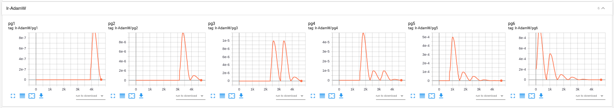

# Differential learning rates with Pytorch Lightning

This project shows how to implement differential learning rates for transfer learning using `Pytorch Lightning`. 

It heavily relies on the approach presented by [Lucas Vazques](https://github.com/lgvaz) in the issue [#2005](https://github.com/PyTorchLightning/pytorch-lightning/issues/2005). So most of the credit goes to him :)

## How it works?

You can read about differential learning rates for transfer learning in blog posts [here](https://blog.slavv.com/differential-learning-rates-59eff5209a4f) and [here](https://towardsdatascience.com/transfer-learning-using-differential-learning-rates-638455797f00).

## Implementation
Basic steps needed to make differential learning rates work are as follows:
 
1. Implement your `pl.Module` as you would usually do, just remember to inherit from `ParametersSplitsModule` class. This will give you access to `freeze_to()`, `get_optimizer_param_groups()` and other methods. Methods that do the actual model freeze are defined as utility methods. Base your work on the `transfer_learning_diff_lrs.py`.
2. Choose your backbone NN architecture. This example uses **ResNet-18** (just so that it trains faster).
3. Switch out the fully connected layers to suit your needs:
    ```Python
    # 1. Feature Extractor:
    self.model = models.resnet18(pretrained=True)
    _n_inputs = self.model.fc.in_features
    _n_outputs = 10  # 10 outputs for the CIFAR10 dataset 

    # 2. Classifier:
    _fc_layers = [torch.nn.Linear(_n_inputs, 256),
                    torch.nn.Linear(256, 10)]
    self.model.fc = torch.nn.Sequential(*_fc_layers)  # Switch the FC layers in the backbone
    ```
4. Define the model splits. These will be your parameter groups that will be trained with different learning rates independently of one another. Below is a sampel code for the **ResNet**. This will result in 6 splits.
    ```Python
    def model_splits(self):
        groups = [nn.Sequential(self.model.conv1, self.model.bn1)]
        groups += [layer for name, layer in self.model.named_children() if name.startswith("layer")]
        groups += [self.model.fc]  # Considering we already switched the head

        return groups
    ```
5. Define your milestone config. Keys in this dictionary represent epoch numebers. We start with the 1st epoch. We freeze the models last layer (`'freeze_to': -1`). If we would like to train whole model then we need to set `'freeze_to': 0`. We train the model for 1 epoch with this config. Since only the last layer is unfrozen the learning rate array for the param_groups looks like this: `'lrs': [.0, .0, .0, .0, .0, 1e-3]`. The learnign rate for the last layer is equal to *1e-3*. Following this scheme, we unfreeze another parameter group. We progressively decrease LR for the deeper layers. In the 2nd epoch we train newly unfrozen param group with the LR of *5e-4*. Notice that LR array in current implementation has always as many elements as there are `model_splits`. I would like to refactor this but I am too lazy to do so... We repeat the procedure for as many epochs as we want (in this example for total of 6 epochs - one per each param group). `pct_start` refers to `pct_start` of the `OneCycleLR` scheduler. 
    ```Python
    milestones = {
        1: {

            'freeze_to': -1,
            'duration': 1,
            'pct_start': .3,
            'lrs': [.0, .0, .0, .0, .0, 1e-3]
        },
        2: {
            'freeze_to': -2,
            'duration': 1,
            'pct_start': .3,
            'lrs': [.0, .0, .0, .0, 5e-4, 5e-4]
        },
        3: {
            'freeze_to': -3,
            'duration': 1,
            'pct_start': .3,
            'lrs': [.0, .0, .0, 5e-5, 1e-4, 1e-4]
        },
        4: {
            'freeze_to': -4,
            'duration': 1,
            'pct_start': .3,
            'lrs': [.0, .0, 1e-5, 1e-5, 5e-5, 5e-5]
        },
        5: {
            'freeze_to': -5,
            'duration': 1,
            'pct_start': .3,
            'lrs': [.0, 1e-5, 1e-5, 1e-5, 1e-5, 1e-5]
        },
        6: {
            'freeze_to': 0,
            'duration': 1,
            'pct_start': .3,
            'lrs': [1e-6, 1e-6, 1e-6, 1e-6, 1e-6, 1e-6]
        },
    }
    ```
6. Implement a *"dummy"* `configure_optimizers()` method. Like so:
    ```Python
    def configure_optimizers(self):
        # passed lr does not matter, because scheduler will overtake
        param_groups = self.get_optimizer_param_groups(0)
        opt = torch.optim.AdamW(param_groups, weight_decay=self.weight_decay)
        # return a dummy lr_scheduler, so LearningRateLogger doesn't complain
        sched = OneCycleLR(opt, 0, 9)
        return [opt], [sched]
    ``` 
7. Implement the `on_epoch_start()` method in your `pl.Module` that will utilize the milestone config defined above.
    ```Python
    def on_epoch_start(self):
        if self.current_epoch in self.milestones.keys():
            milestone_config = milestones[self.current_epoch]
            # Unfreeze all layers, we can also use `unfreeze`, but `freeze_to` has the
            # additional property of only considering parameters returned by `model_splits`
            self.freeze_to(milestone_config['freeze_to'])
            # Create new scheduler
            total_steps = len(model.train_dataloader()) * milestone_config['duration']
            lrs = self.get_lrs(milestone_config['lrs'])
            opt = self.trainer.optimizers[0]
            sched = {
                'scheduler': OneCycleLR(
                    opt,
                    lrs,
                    total_steps,
                    pct_start=milestone_config['pct_start'],
                    div_factor=self.div_factor,
                    final_div_factor=self.final_div_factor,
                    base_momentum=self.base_momentum,
                    max_momentum=self.max_momentum
                ),
                'interval': 'step'
            }
            scheds = self.trainer.configure_schedulers([sched])
            # Replace scheduler and update lr logger
            self.trainer.lr_schedulers = scheds
            lr_logger.on_train_start(self.trainer, self)
    ```

## Monitor the learning rates
The code for this example contains a **TensorBoard** integration, so that you can monitor the progress and how the learing rates are changing over the course of the training session. Your learnning rate charts should look more or less like this: 

## Further work
No further work for this project is planned. I might occasionally update it so that it's still compatible with **Pytorch Lightning**. 

*If **Pytorch Lightning** starts supporting differential learing rates out of the box I will archive this repo.